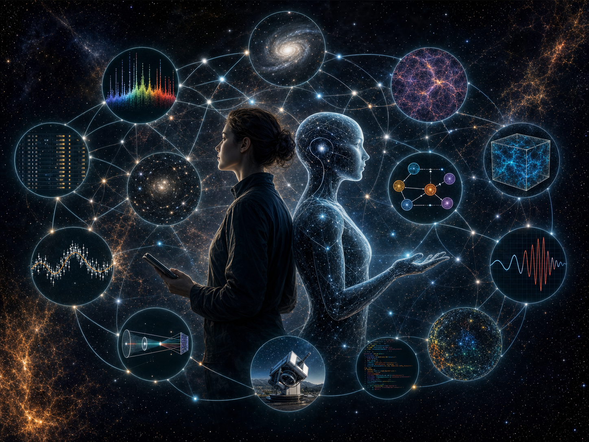

<section class="notice-card">
  <h2>Poster Brief</h2>
  <dl class="notice-facts">
    

      <dt>Workshop</dt>
      <dd>Accelerating Astrophysical Discovery with Foundation Models</dd>
    

    

      <dt>Date</dt>
      <dd>14-18 September 2026</dd>
    

    

      <dt>Location</dt>
      <dd>Lorentz Center@omega, Leiden, The Netherlands</dd>
    

    

      <dt>Purpose</dt>
      <dd>Design input for a digital poster and workshop icon</dd>
    

  </dl>
</section>

The workshop has two pillars.

The first is designing how humans and machines jointly study the cosmos. Humans ask the scientific questions, judge evidence, and decide what counts as discovery. AI systems can help retrieve, compare, simulate, and test evidence across archives that are too large for unaided human attention.

The second is building a joint-representation model for astrophysics: a foundation model that learns a common language for images, spectra, time series, catalogues, simulations, instruments, code, and provenance.

The key scientific ambition is to accelerate serendipity. We want systems that help researchers notice rare objects, surprising analogues, missing context, and cross-instrument relationships they might not know to ask for.

## Organizers and current affiliations

- Joshua G. Albert: California Institute of Technology; Leiden Observatory
- Roberto Ruiz de Austri: IFIC; CSIC; Universidad de Valencia
- Sascha Caron: Radboud University; Nikhef
- Francisco Villaescusa-Navarro: Simons Foundation
- Gabrijela Zaharijas: University of Nova Gorica

## Workshop topics

- Monday: Shared vocabulary, use cases, and evaluation targets for human-AI discovery.
- Tuesday: The relevancy graph: linking observations, simulations, instruments, code, provenance, hypotheses, and results.
- Wednesday: Long-context model architecture and training protocol for heterogeneous physical data.
- Thursday: MVP design and hackathon work on schemas, examples, evaluation specs, and prototype code.
- Friday: Consortium roadmap for funding, governance, partnerships, and post-workshop continuity.
